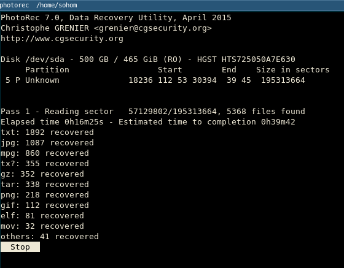
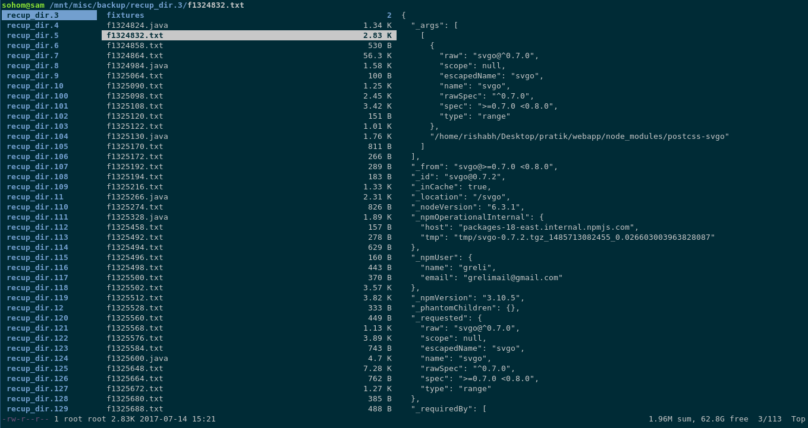
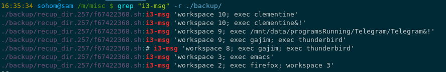
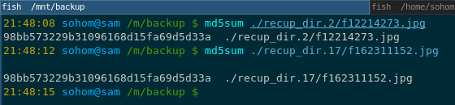

Title: Experience with Data Recovery
Date: 2017-07-20
Tags: CS, Linux

### Prologue ###

We have been planning to set up a backup utility on Sam but somehow we never quite got around to actually doing it. However this week we finally decided to do it. We decided to try out [Obnam](https://obnam.org/). Things were going good until we needed to delete a directory.

Now remember that this directory was local directory and not a system directory unlike how the name suggests. The directory in question is "mnt".
Yes we had set up the dummy directory tree for experimenting with the backup tool and it had a mnt in it. 

So for deleting it Sohom should have typed `rm -rf mnt` but he typed `rm -rf /mnt`.
Notice the '/' in the command he typed, Yep true story. Completely nuked all the mounted partitions.

### Some Context ###

Okay we need some context. This is how `lsblk` looks on our system (Sam). The important partitions that store all the main data and media (movies and documentaries and Pics) are the `/dev/sda4` and `/dev/sda5`. As both of them were mounted they both were completely deleted. 

### Aftermath ###

Okay so what DID we lose ?

* ALL  work related files ( We keep a work_space directory )
* ALL of our music collection ( this is what keeps us sane )
* ALL of our Pictures that we had saved ( nice memories :'(  )
* ALL of our documents ( amazing PDF files, and books and other stuff )
* ALL of our documentaries and movies.
* All of our MOOC videos that we had saved. 

So yeah! EVERYTHING. 

### The Recovery ###

Now this is where we will trace the thinking that enabled us to get back almost all of our data. 

The First thing that we did was to unmount the affected partitions so as stop any data being overwritten on those partitions. This would increase the chances of getting most of our data back.

Then we downloaded [PhotoRec](https://www.cgsecurity.org/wiki/PhotoRec) ( in Arch it is packaged with the TestDisk package ). We started PhotoRec form the terminal and followed the steps to select the partition we wanted to recover and also we had to select the partition where the recovered files would be stored. It is recommended that the partition where you store the recovered files and the partition that you want to recover data from be different partitions as this would reduce the chances of the old data being overwritten. 

Now after this you might see something like this. .

This is normal and its perfectly fine to go about doing other stuff that you have to do while PhotoRec "walks" through the file-system and recovers files for you. 

One thing we should remember is that the recovery part is not such a pain! PhotoRec is amazing and does an amazing job. The main pain is actually picking up the files that YOU want from he whole bunch of recovered files. This is because since PhotoRec does not have any method to determine if the deleted files were deleted accidentally or not, it recovers everything that was deleted and not overwritten. Thus we have a LOT of work to do. 

### After the recovery ###

These are some of the things that PhotoRec does after recovering the files.
* Stores everything under multiple `recup_dir.<integer>` directories. It looks something like this 
* Every file other than text files are properly named. As in other than text files all other files have their proper extensions. Thus PhotoRec doesn't mix up JPEG and PNG files.
* That being said it does mix up text files. As in recovered Java files would sometimes be named as C++ header files and so on.
* PhotoRec also recovers ELF files which are nothing but executable files.

<blue> How do we go about sorting this mess ?</blue>
Our first idea was to launch [ranger](http://nongnu.org/ranger/) and inspect every single directory and delete directories if the contents didn't feel too important. Something like this.

But there was a major flaw with this system. There were a lot of files in those directories and going through each one of them would be a tedious and a very very stupid thing to do. 

So we started making a list of the things that we lost and the things that we wanted to recovered from the mess. We figured that if we could not remember something that we had lost them we probably did not need it in the first place. Thus we figured that the most important stuff in the data directory ware the scripts that we had written for our Arch System. We also realized that we mostly needed text files from this partition recovery so we could delete all the non-text files and thus we started this massive assault on all non essential files. 

Initially we were writing scripts like 
	
	:::bash
	$ for file in (find ./ -name "*.jar"); rm -vf $file; end;

which worked like a charm. 

Then we figured out the better version of this command i.e.
	
	:::bash
	$ find ./ -name "*.jar" -delete

which does the same thing; finds files with a particular extension (JAR files in this case) and delete them.

We kept doing this for a huge set of files unless we were left with only text files.

Now we needed to get all the DOCX files so we did this
	
	:::bash
	$ for file in (find ./ -name "*.docx"); cp -c $file ../store; end;

Now comes the interesting part. Remember those scripts that we wrote. We had a fairly good idea about the contents of those scripts so we could do a recursive grep with those keywords and BOOM! 

This is the first script which had a lot of i3-msg in it.

Similarly we found all the other scripts.

### The Second Partition ###

This partition posed a different kind of challenge. We wanted to recover all the images that we had. We ran PhotoRec with the option that would only recover only the JPEG files. But even after that we had about 12000+ JPEG files. Moreover inspection with ranger showed that certain files were duplicated. To confirm our assumption we check the MD5 hash of two such files.

As you can see both the files have the same MD5 hash and thus they are essentially the same files. So now we needed a script that would sort the duplicate files out.

We followed the instructions in this article and installed fdupes and let it run amok and remove all the duplicate files we had.

Also we figured out that there were a lot of files that were 100kb or less. These were thumbnail files we believe. So we did this

	:::bash
	$ find ./ -size -100k -delete

and all of them annoying files were gone. :p

### Conclusion ###

<blue> So what is the takeaway from all this ? </blue>

* OFFSITE BACKUPS
* ALWAYS HAVE BACKUPS BEFORE PLAYING WITH IMPORTANT FILES
* PhotoRec is pretty awesome
