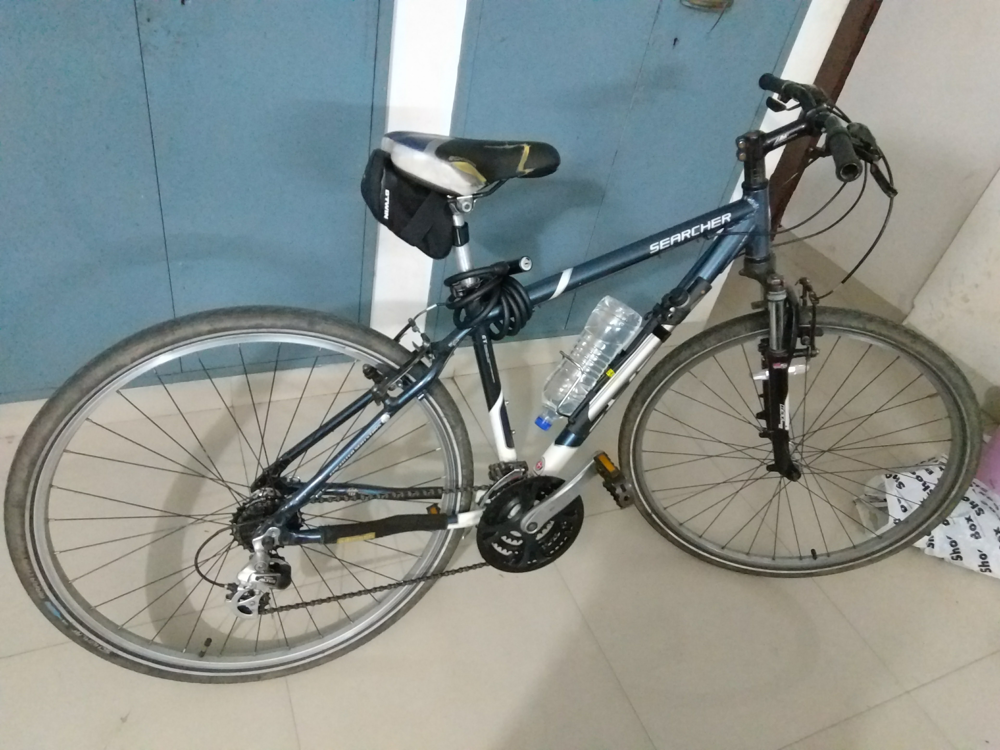
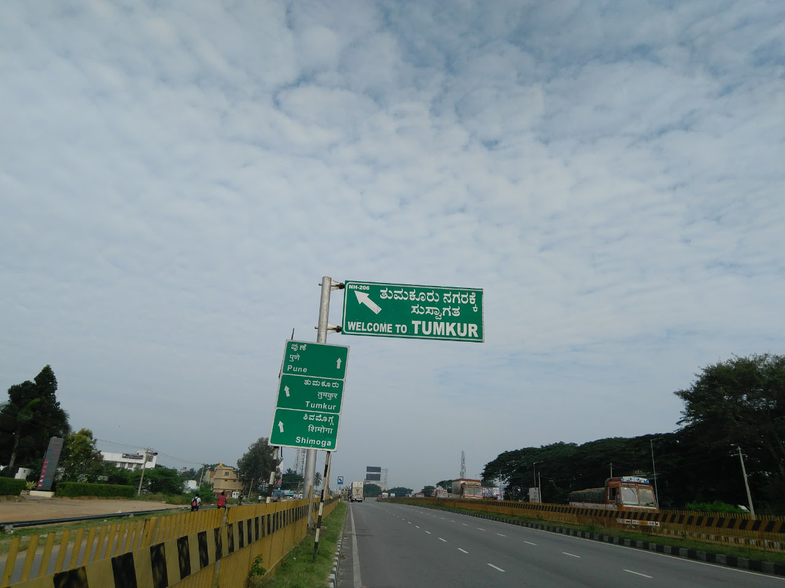
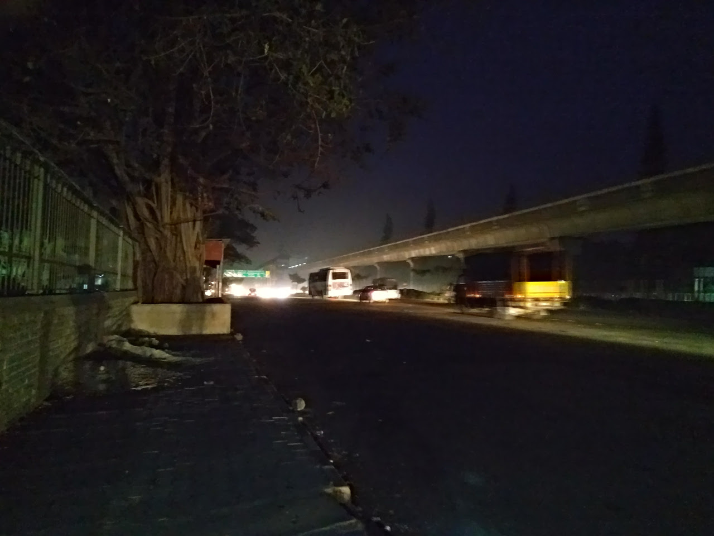
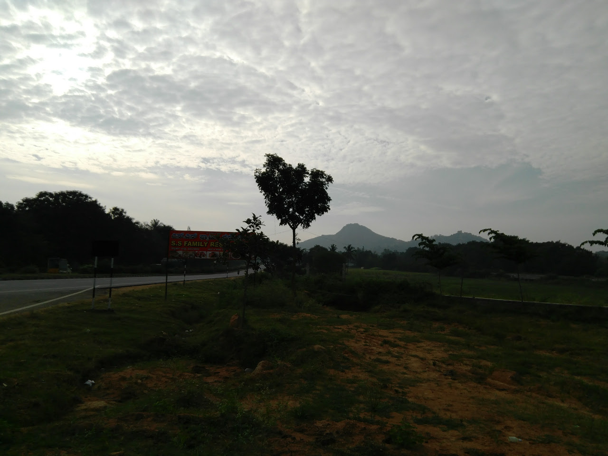
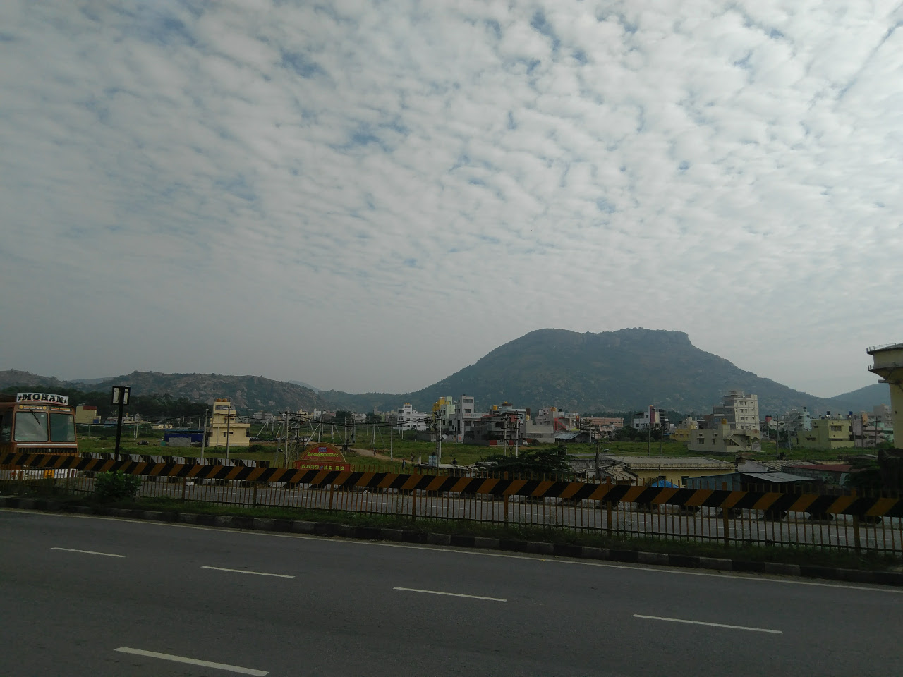

Title: My First 100km Bicycle Ride
Date: 2017-11-08
Tags: Cycling, Travel

Last Thursday (2 November, 2017) I completed my longest cycling ride
(yet!). It was tiring and awesome at the same time. It took 7 hours to
complete that too with multiple stops in the middle of the ride.

### The Motivation ###

I've been planning to do a 100k ride for a long time but I didn't
really got to it because something or the other always came up and I
was being very very lazy. However a lot of things changed in the last
week and most importantly me and my brother(who also happens to be an
avid bicycling fan based in Kolkata) are planning to go riding when I
visit my hometown in Kolkata. Thus I thought that it would be a good
idea to get some miles under my belt.

### The Planning ###

This was the easiest part to decide. I was very sure that I did not
want to do a 50 km ride; I wanted something bigger. So i decided to do
a 100+ km ride. The destination was Tumkur because that was the only
town near to Bangalore with a perfect distance for this ride. Tumkur
is 60kms from Bangalore (this distance is from my hostel which happens
to be on the border of Bangalore (so to speak)).

I could've chosen a route inside Bangalore but I did not do that
because
- Being within the city is like a safety net. There is always the
  possibility of taking an auto and calling it a day.
- Bangalore streets are very shitty to ride on. Its the weird
  combination of the condition of the roads and the multitude of
  moronic motorists.
- Whenever I try something new and bold I like not having any easy
  backup options as I have found that this combination of "no easy
  backups" and "difficult task" are very good and they help me
  grow. :-)

The road to Tumkur is a National Highway and is very very
straight. Thus there was nothing that could go spectacularly wrong
other than myself getting killed on the Highway. Honestly I think that
the chances of me getting hit by a car and killed is way more in the
city than on the Highway. Also there was no issue of getting lost on
the way and I was very prepared for any punctures and other equipment
related hiccups.

### The Nutrition ###

I carried peanut brittle because its made of peanuts which is mighty
healthy and it also had jaggery which is a better form of consuming
sucrose as the rate of absorption of sucrose into the body is
regulated in jaggery since it has fiber. So I figured that with each
peanut Brittle I would get a steady and sustainable flow of glucose
(sucrose breaks down into glucose and fructose). (this is not based on
any scientific research. This is just based on what I have learned
about refined and unrefined sugar and 2+2=4 )

I also had a jam-bread when I reached tumkur. 

I also had a coconut water on the way. It was very very refreshing
especially after sweating and all. I feel that this was very important
as it helped replenish a lot of depleted electrolytes.

I ate two bananas before starting because I couldn't resist the
temptation. :-P

### Packing ###

This was a very interesting part where I found myself performing
calculations so that I could carry the most effective load in the most
efficient manner.

This is one of the most important parts of the trip because without
the correct stuff you might find yourself unprepared for a wide range
of possible situations out on a trip at a location where finding
relevant help would be very difficult.

You also do not want to carry too much extra stuff because every added
gram means more weight on your shoulders. This is not a big deal but,
when you factor in the fact that I do not have a Pannier rack and I
have to carry all that stuff a shoulder bag it means all that load
will be resting on the small bones on my butt that in turn would rest
on that saddle. Factor in the distance (100km+) and time (6hrs+) of
cycling and you have the perfect recipe for a sore butt.

I did not carry/wear any jackets since the waste heat from my body
would eventually heat me up.

Anyway after solving the Linear Programming Problem I found the
optimum carrying requirements
- Food (Peanut Brittle)
- 1.75 Liters of Water (1L + 750ml)
- Tyre repair kit (Patches + Glue + Tyre levers + sand Paper)
- Emergency tools (multi tool + Single Hex Key)
- A spare inner tube (for those un-repairable punctures)
- Portable Pump
- Btwin Saddle Bag
- 2 Bananas (I ate these for breakfast so I don't think I should count them)
- Pen and Notepad
- My Phone
- A cap
- My helmet

Here is the full inventory laid out for a photo. Note that the tube is
missing because I forgot to keep it
there.  

I fit a bottle holder on the cycle and put a 1 Liter bottle
there. Also I used an attachment to fix the portable pump onto the
frame of the cycle itself. So in the end I was carrying about 2
Kilograms including the weight of the bag which is not too bad.

### The TRIP!!! ###

Before this trip I was kinda scared of solo trips; and I would always
go out with Arun on longer rides. But I realized that at some point I
would have to go out myself and I love beign alone so I went on with
it. I was so scared before this ride that I was hoping that Arun would
not be able to let me borrow his backup gear for this ride and so I
would have a reason to cancel it. :-P

BUT soon the alarm rang at 4 o'clock in the morning and it was time
for me to get going. So I woke up; checked the cycle for any defects,
checked the indexing of the gears, loaded up the gears, dressed up for
the event and Left. :-P I left at 5:30 in the morning which was a mere
half hour behind schedule.

This is how it looked fully loaded.

The first leg of the journey was amazing without any hiccups. The
weather was amazing, it was cool and the sun was merciful. I crossed
the "Welcome to Tumkur" sign on the highway at 8:22. So this leg took
exactly 3 hours with two stop in the middle (I stopped to have a
Peanut Brittle and to have coconut water :-P ) which gives me an
average speed of 20 kmph which is not at all bad especially if we
consider the fact this is my first 100km ride and my third long
distance ride in my life (yes!!).

Here is a pic. :-P

Then I stopped at a bakery to have some jam-bun (white-bread + jam)
which was good decision as I think that this gave me more than enough
energy and also some well-needed rest for my legs. I also refilled my
water bottle. I had used only about 750ml out of the total water that
I was carrying.

Weird thing. There was a distance marker at Tumkur that said that
Bangalore was 70kms from that point. Here it is.

This was very unsettling because this was weird, conflicting and new
information. Then it hit me that maybe what is Bangalore and what is
Tumkur is not fixed. Maybe they were measuring Bangalore from that
location to some place that was not where I was measuring Bangalore
to. So i was relieved. :-P

I started from Tumkur after about 15 mins. This is the part where
things started to get ugly. The weather was bad, it was hot and the
sun was not merciful. I soon realized how tired I was and there was a
slight uphill climb just outside Tumkur (around 10km from
Tumkur). This proved to be a huge challenge. I couldn't do it. So I
ended up pushing the cycle for about 1 km. This was a relief at that
moment. This continued for sometime. I think I stopped and pushed or
stopped and sat down under a tree (btw trees are amazing on a highway
especially on a sunny day) for multiples times. I think I had to push
my cycle about 4 or 5 times. I did not push them too much, maybe just
about 1 km or so. But yeah these were some well needed rests.

This is a pic when I was resting under a tree. 

I reached my hostel at 12:30 which was over 6 hours. I am actually very
surprised that I managed to maintain a decent 20kmps overall. :-P

### PHOTOS!!! ###

Did I mention that I took photos :-P ? (I absolutely love the camera
in this new phone :-) )

This was just before starting right in front of my hostel gate.

This was a random location where I stopped

A random tree with a random hill in the background.

A random hill with weird looking clouds

The not-random sun behind weird clouds

### Conclusion ###

It was super fun and I think that I will keep on doing this again and
again. Next goal is Mysore. :-P

I used OsmAnd to record the GPS traces and it was absolutely
phenomenal. I had no idea it would be this amazing.

Here is what OsmAnd has to say about the trip with Speed (Orange) and
Altitude (Blue) on the same graph. I think we can clearly see the
correlation between the altitude and the speed.

The speed part of the GPX track is also interesting which says my
maximum speed was 46 km/hr which was just for a short while during the
starting phase. I think this was during the descend from my hostel
towards jalahalli via Tumkur Road.

Here is
the
[GPX track](assets/files/2017-11-08/2017-11-02_05-39_Thu(100KM).gpx)
just in case.

p.s. this was longer than I expected it would be. :-P
