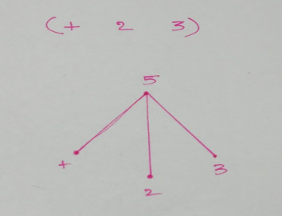

Title: Scheme - Part 2 - Expressions and Evaluations
Date: 2017-11-30
Tags: CS, Scheme

### S-expressions ###
[S-expressions](https://en.wikipedia.org/wiki/S-expression) or Sexprs or Symbolic Expressions are used to
represented list like data. This was invented for and popularized by
LISP. Lisp stands for LISt Processing. 

A list looks like this `(x y ... z)`

A list can be made up of other lists as well. Like so `(x (a b c) (d e f))`

In Lisp (and any other lisps) every program is a represented as a
list. In-fact this is the one and only style of writing programs in
LISP and this leads to some very interesting properties of lisp
programs.
1. Data and instructions (that work on the data) have similar
   representation within the program structure.
2. You have to pay close attention to evaluation models or how each
   list is evaluated.
3. The whole program can be represented as a tree.

### Program Structure of Lisp ###

If we look at the structure of a LISP program we will notice that
there is not proper structure to the code other than the usual LIST
structure and everything within that language (from variables to
procedure calls) are represented with the same structure. This is
interesting because this is directly related to the kind of computing
model this language is based on. Lisp is based on a model of computing
called [Lambda Calculus](https://en.wikipedia.org/wiki/Lambda_calculus). It was invented by [Alonzo Church](https://en.wikipedia.org/wiki/Alonzo_Church).

On the other hand procedural and object oriented languages are based
on a model of computing called the [Turing Machine](https://en.wikipedia.org/wiki/Turing_machine). In these
languages there is some structure that lets us differentiate between
what is code and what is data, but that is not the case in
Lisp. Infact in Lisp code is treated as data in the form of [higher
order procedures](https://en.wikipedia.org/wiki/Higher-order_function).

Lisp programs are trees. In other words the lists can be represented
as tree such that
- Every list within a pair of _(_  _)_ is treat as a node in the tree
- The very first element of every list is the first child of that node
  in the tree. This is the operator.
- Every other element of that list is a child of that node and are the
  operators for that operand.

The tree of the expression `(+ 2 3)` will look like this

A LISP program is very easily parse-able by a computer as Trees do
not need complicated rules for traversal and other operations. In-fact
this sounds almost similar to the parse-tree of a
[Context-Free Grammar](https://en.wikipedia.org/wiki/Context-free_grammar).

_<blue>The Substitution Model</blue>_

This is probably one of the most simplest models of evaluation. It is
also very powerful. It is also recursive in nature. Let us write a
basic definition of the Evaluator.

Let the Evaluator be `E`. It accepts an expression as input and
evaluates it. Let the expression be `expr`

- On receiving an expression _expr_ evaluate the sub-expressions (using
  the same model; so this is a recursive call to _`E(sub_expr)`_ where
  _sub\_expr_ is the sub expression)
- Apply the results of the sub-lists as operands to the operator of this list.

In list the first element of any List is treated as the operator while
the rest are treated as the operands.

	#!scheme
	> (+ 2 3 4) ;; + is the operator and 2, 3, 4 are the operands
	> 9
	> (* 2 3 4) ;; * is the operator and 2, 3, 4 are the operands
	> 24
	> (> 2 3)   ;; > is the operator; this is equivalent to 2 > 3 
	> f

This also applied for lists that have other lists in them. Let's have
a look!

	#!scheme
	> (+ 2 3 (+ 2 2))
	> 9

Let us trace what happens here.  First the evaluator receives the
expression `(+ 2 4 (+ 2 2))` and then it evaluates the internal list
first. Which is `(+ 2 2)`. This expression evaluates to `4`.

In the tree form this is how the above expression would look

Then the evaluator _substitutes_ that result to the actual expression
before continuing on with the evaluation. So now the expression looks
like this `(+ 2 4 4)` and then we get the final answer.

### Evaluation Strategies ###

Lisp uses an [Eager evaluation](https://en.wikipedia.org/wiki/Evaluation_strategy#Applicative_order) strategy. This is also known as Strict
Evaluation or Applicative evaluation. In this strategy all the
operands are evaluated first before applying them to the function.

In lisp this is the only structure that we have. So conditional
branching (if-else, case). The if-construct in LISP looks like this.

`(if (expression) (expression1) (expression2))`

Now the _if_ macro is special because it does not follow the normal
evaluation strategy i.e. all the three expressions _expression_,
_expression1_ and _expression2_ are not evaluated before the procedure
is applied. In this macro only the first expression (_expression_) is
evaluated first and if it evaluates to be true (_#t_) then
_expression1_ will be evaluated. Otherwise _expression2_ will be
evaluated.

	#!scheme
	(define (recursive x)
		(if (= x 0)
			0
			(recursive (- x 1))))

	(recursive x 1)

What happens when we evaluate the last expression ? Nothing
spectacular. We just get the value `0` which is what it is supposed to
do. We get this answer only because LISP uses normal order evaluation
(lazy evaluation) for the _if_ construct. If like the default strategy
it used applicative order evaluation then both the `0` and the `(recursive
(- x 1))` would be evaluated before calling the procedure and that
would lead to an infinite loop. But the if-constructs uses [Normal order](https://en.wikipedia.org/wiki/Evaluation_strategy#Non-strict_evaluation) evaluation or non-strict evaluation.

My next program will illustrate this. For that we will define a
`new-if` procedure that will do exactly what `if` does.

	#!scheme
	(define (new-if predicate exp1 exp2) 
		(cond (predicate exp1)
			(else exp2)))

This is the _new-if_ procedure. Let us use this in our previous program.

	#!scheme
	(define (recursive-new x)
		(new-if (= x 0)
			0
			(recursive-new (- x 1))))

	(recursive-new x 1)

What happens now ? 

__NOW__ the thing goes into a spectacular infinite loop. That is
because the _new-if_ procedure will be evaluated using the applicative
order strategy. Thus all the operands will be evaluated before the
_new-if_ procedure is called; and _recursive-new_ has a call to
itself. So in the end it all splatters exceptionally well.

P.S. I have written this post based on my own
experience which is a very very limited one. I do not claim that what
I have just said is the ultimate truth or the _only_ thing out
there. My short life and my shorter experience with LISP is not nearly
enough to cover the full depth and breadth of LISP
