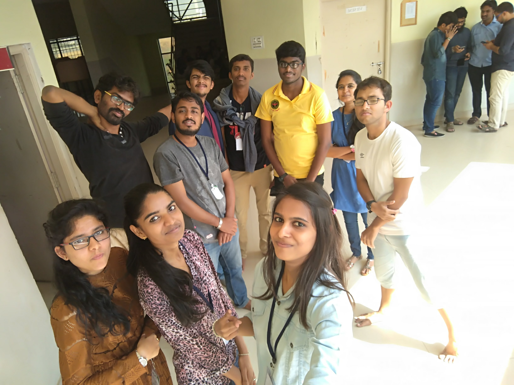
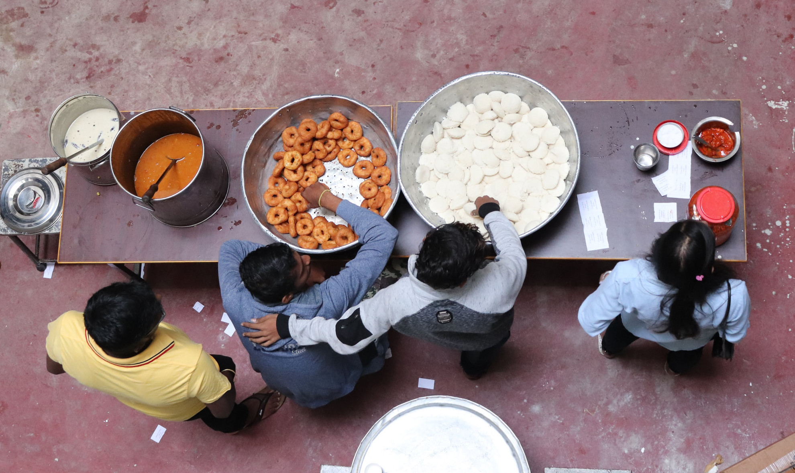

Title: FSMK Winter Camp, Hassan
Date: 2018-02-16
Tags: Misc, Work

[Free Software Movement Karnataka (FSMK)](https://fsmk.org/) conducted
a winter camp
at [Rajeev Institute of Technology](http://rithassan.org/), Hassan
from 22nd January to 27th January.

It was a 6 day camp for the the participants with 2 days dedicated to
volunteer training before the camp. In this camp we had three
different areas of CS that we were focusing on viz. Web Development
using Ruby on Rails, Android Development and IoT. This camp was
organized by the Hassan level regional glugs of FSMK.

I volunteered for IoT track because I have no interest in Web
Development and Android Development. Apart from this the main speaker
for the hardware track
was [Ganesh (cosmobird)](https://cosmobird.github.io). He has been a
great source of inspiration to me ever since I met him for the first
time in camp 2016. Moreover hardware and electronics are something
that I love to read about but I was never too _hands-on_ with and I
wanted o remedy that.

## The IoT track
The IoT track was mind-blowing. We were using NodeMCU chips as the
basic hardware for this track. The main syllabus of the track focused
on creating a weather station along with Mesh Networks and Software
Defined Radio. In fact Ganesh and his friends (Niranjan and Mugilan)
gave the participants a live demonstration of Software Defined Radio
with an RTL-SDR chip.

Fun-Fact: I was given the responsibility (read: volunteered) to
procure some of the hardware for the IoT participant kits that we were
supposed to give to the students. We had ordered 45 Kits. Apart from
getting the equipment it was also my responsibility to check if all
the NodeMCUs were working or not. This was the most fun part of the
whole exercise. I ended up making a temporary production line sort of
thing so as to optimize my testing and packing routine. :-P

###### Iot team (some are missing, some are extra)######

## Being a speaker
I was a speaker at this camp. This was the most scary part for me. I
had never spoken at such an event before.

Being a speaker in this camp was admittedly a new, scary and
profoundly educational experience for me. 

My session was the introductory session (the _hello-world_ into
NodeMCU programming).  The _hello-world_ involved getting the
participants' laptops to boot with the LIVE OS (Fedora) and then
connecting the NodeMCU and the pushing the first code into it.

Just to keep things a bit funny and interesting I threw in an arduino
joke.  While introducing the participants about the function
_digitalWrite(PIN, MODE)_. I said

> With digitalWrite you can set a specific pin to be either HIGH or sober.

###### did you see what I did there ?? :-P ######

This cracked up all the stoners in the group. 

Being a speaker I realized that I do like teaching and that I am quite
good at it. Even though I was very scared of taking the session I was
surprised when people started to tell me that I was a good speaker and
that they enjoyed my session very much. This gave me a much needed
boost.

Other than that I was also a volunteer every volunteer was assigned a
group of 5 people. My group was amazing. My group was self-sufficient
in a way, other than any super-complicated issue the group had learnt
to help themselves out. This often meant that someone in the group who
had the problem figured out would help out the rest pf the people. I
am so proud of them. :')

## Getting out of my comfort zone
I DO NOT dance, because I am terrible at it and I do not want to kill
a human being who witnesses that. But, in this camp I did something
that I do no think I would have ever done. During the _Ethnic Day_ at
camp we had a cultural program and I along with some other friends
went up to the stage during a weird flash-mob kind of scenario and
danced (those who were present will tell you that I was just moving
back and forth with a very low frequency but I call it
dancing. :-P). This was the first time I did something like this and
it was an interesting experience.

## The power of the community
Sometime during the culturals the power went out in the auditorium
went out during a dance performance by some of the participants. What
happened next was that the entire audience broke out their mobile
phones and switched on their flashlights and pointed it towards the
stage. It was a beautiful moment. It made me realize that as long as
we are united, we can do anything we want to and nothing is
impossible.

###### People holding up lights!! ######

## Meeting new people
Meeting new people is always fun and I really enjoy meeting new
people. This was something that I was actively looking forward to
during this camp.

Compared to camp 2016 I have grown up a lot; from being a person who
used to be shit-scared of meeting new people I have become this person
who actually enjoys meeting new people and is also a fun person to be
around(I've been told that I should stop the dead-baby jokes though!
:-P).

In camp I also met two people who said that they liked my blog. This
__was__ so amazing to hear. I gave me such intense happiness to know
that someone actually reads what I like and that they also enjoy it
and have been motivated by it.

I also met Nithin who is also into the same topics of CS that I am
into viz. Functional Programming, Programming Language Theory and
Category Theory. Me and him, we talked a lot about Functional
Programming and Compiler Designs. Also Nithin is working with a team
that designs a compiler at National Instruments. So, meeting Nithin
was really awesome because I got to meet a real-life compiler
designer.  :-)

I met a bunch of people from the Open-Hardware
GLUG [GEON](geon.fsmk.org). This the Government Engineering College
Glug. I am not too good with the details. However, these people are
really good with hardware and localization. They have done some amazing [work on localization](https://geongech.wordpress.com/2017/11/15/not-a-days-work/). 

Since I mentioned localization I think I should mention the work Rizma
and her team did with respect
to [Namma-Fedora](https://gitlab.com/Frogster/Namma-Fedora). In this
project they have localized most of the Fedora Xfce Desktop
environment. I have seen it running and its amazing.

Meeting new people is always inspiring.

## Food
Anyone who knows me knows that I do not care much about food. I am a
flexitarian, which means that I really don't care about the food as
long as it is edible.

I really enjoy serving food in these community
events and so even in this camp I took up the responsibility of
serving food whenever I could. I like doing this because this means
that I can interact with everyone even if it is for a short time. I
also threw in some weird pleasantries like "happy lunching" and so
on! :-P

###### People serving breakfast ######

## Conclusion
I think I have covered everything that I wanted to. If not I think I
will add/edit something later on.

Group photo at the end of the camp.

