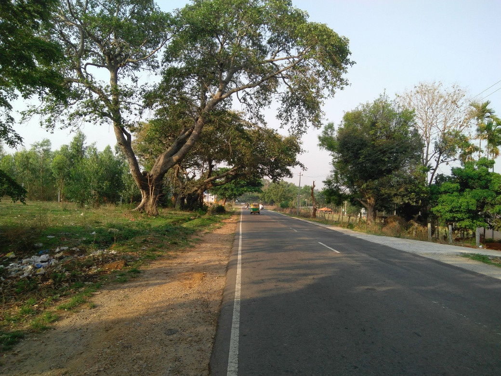
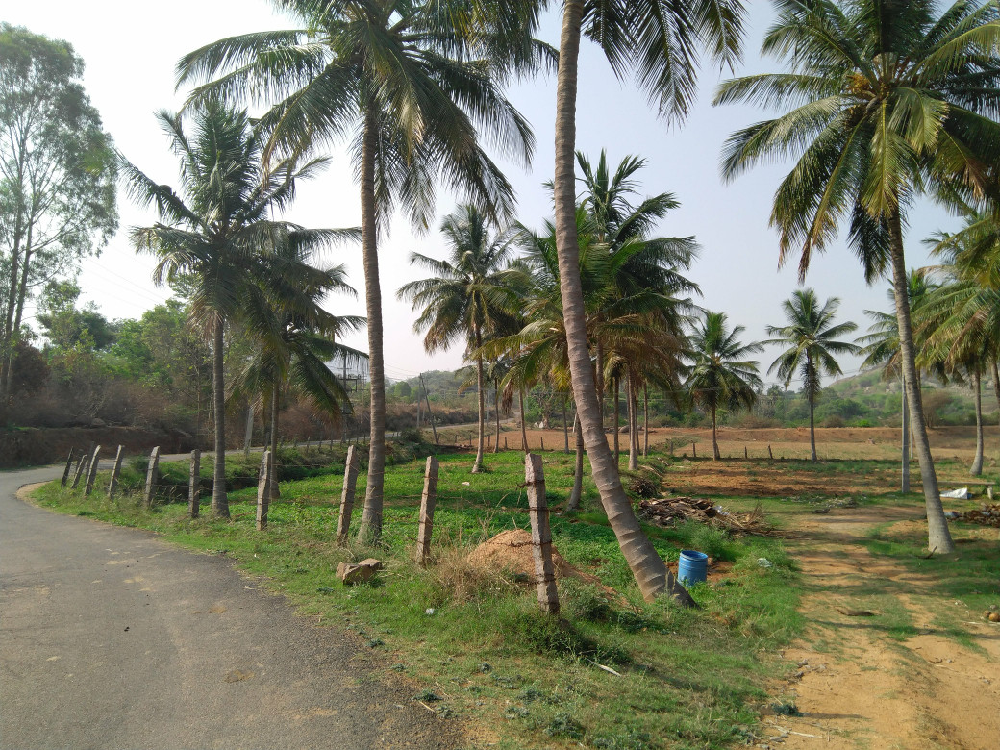
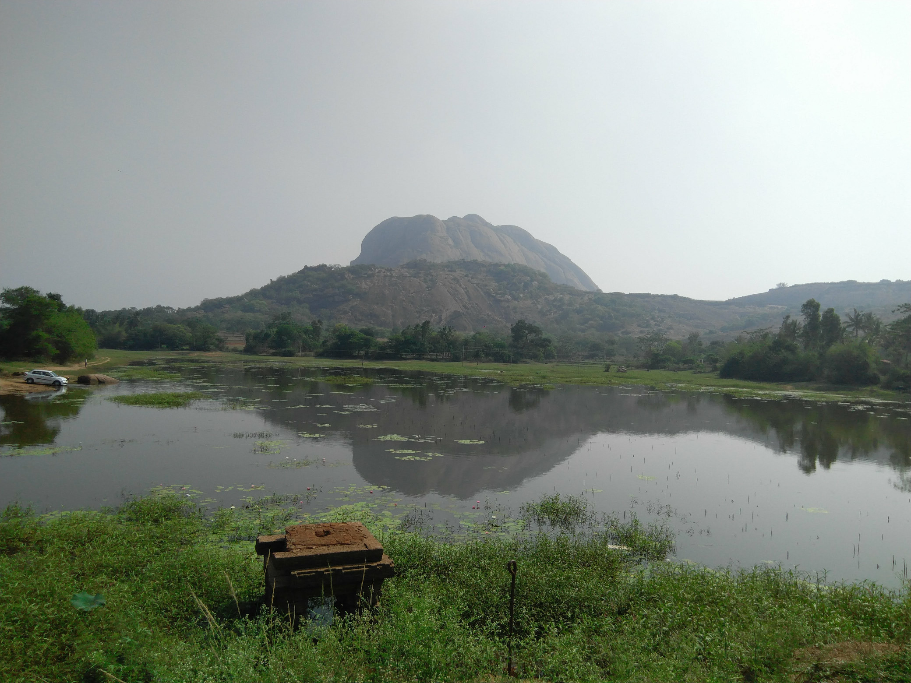
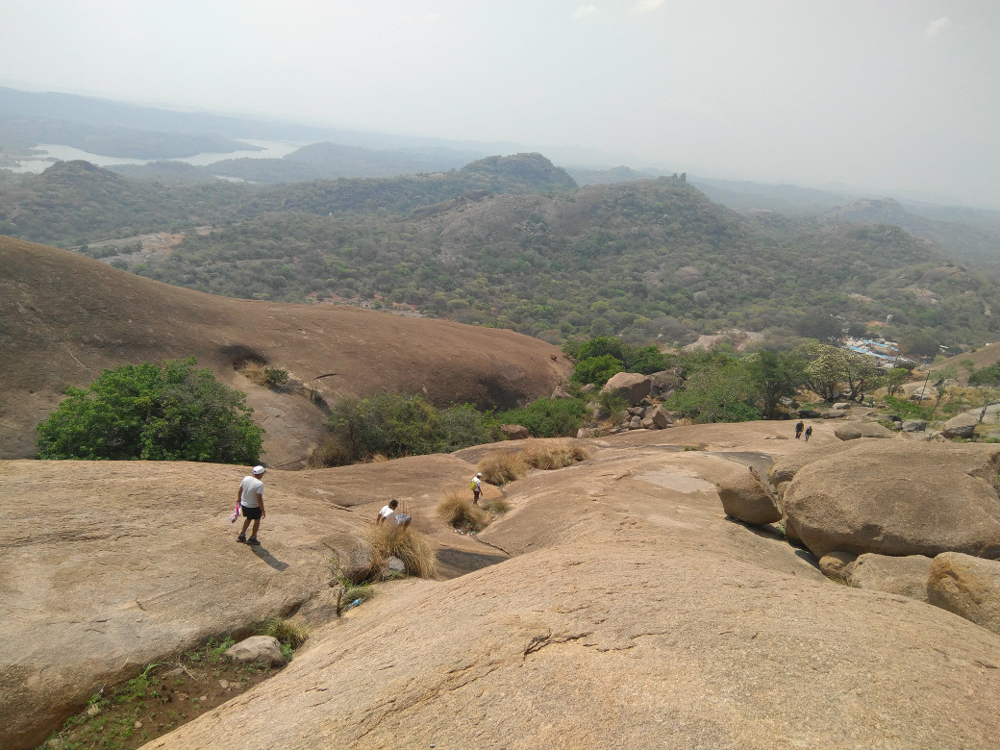
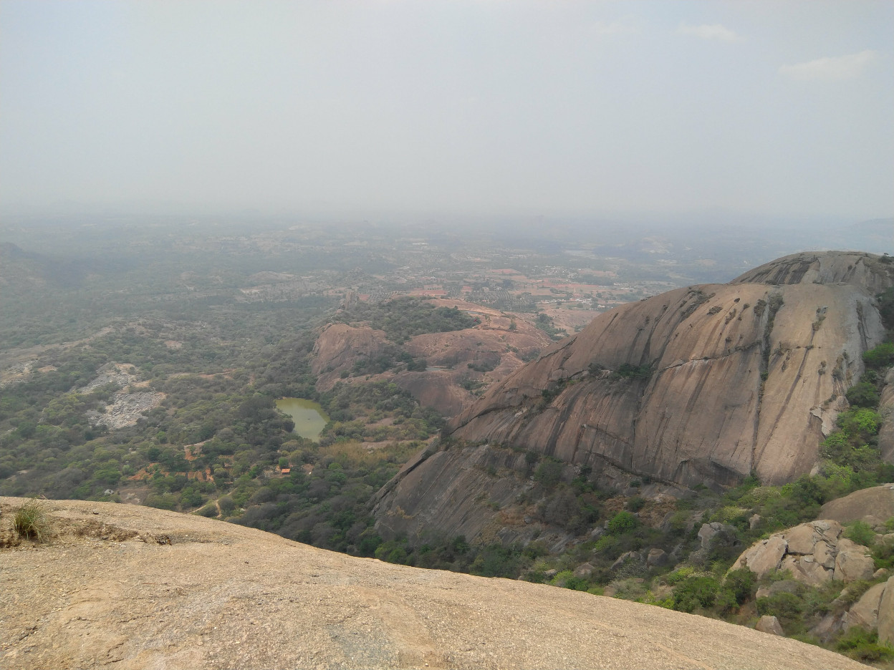
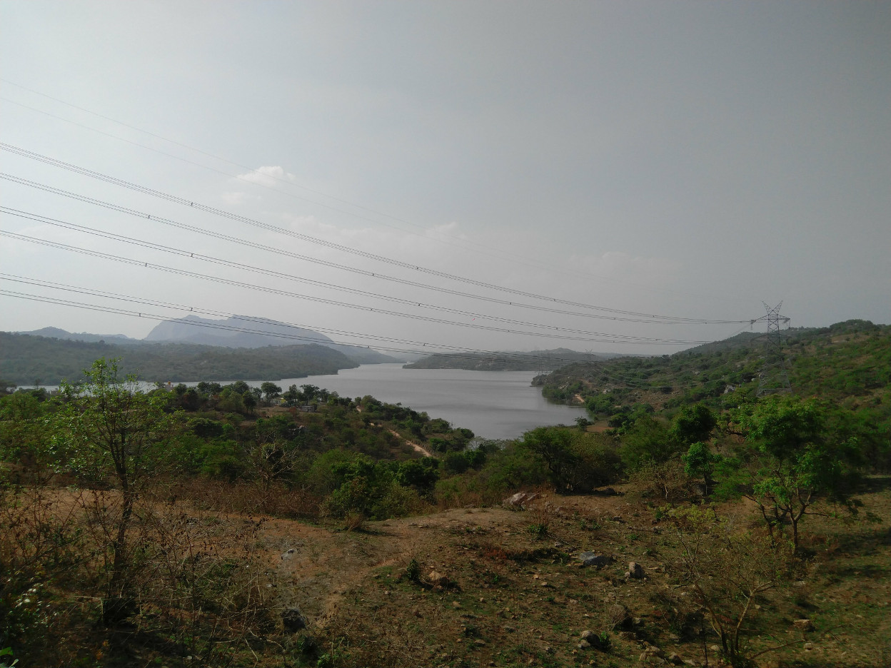

Title: Savandurga Trek
Date: 2018-04-10
Tags: Cycling, Travel, Trek

I came to know about Savandurga Hill a couple of weeks back when me and my friend went there for a casual ride (motorcycle). When we went there the trekking part of the hill was already closed. This was okay since both of us did not plan on trekking anyway. 

However I was hooked by the moment I saw the hill. It is mind-blowing. So after I returned I tried to convince my friends to come along with me, but that did not happen. So I decided to ride to Savandurga and come back. 

This turned out to be an amazing idea.

___
## The Route ##

My initial route plan was to just ride to Savandurga Hill on the Magdi road and come back via the same route as well. However while researching for the route and I came across this page. This page is a route information by the IISc Randonneurs group. Though group does not organize any events anymore the page still exists. 

So my effective route would be :

1. Home
2. T.G. Halli Reservoir (33 km)
3. Savandurga Hill (29 km)
4. Manchanbele Dam (13 km)
5. ISRO Deep Space Network (6 km) 
6. Dodda Alada Mara (4 km)
7. Home (26 km)

Total Distance: 111 km 

I have divided the trip into three parts.

1. Part A - Going to Savandurga
2. Part B - Trekking 
3. Part C - Returning

___
## Part A - Going to Savandurga ##

This part was fairly straightforward. I left home at about 6:30. I started late because I wanted to not-cycle during the 4 hour intense heat window from 1100 hrs to 1500 hrs. 

After riding on the outer ring road for some time I had to take some detour because I had missed my entry to Magdi Road. Once I was on Magdi Road it was okay-ish. Magdi Road is narrow but at least the road is smooth to ride on. 

Once you start approaching the T.G. Halli reservoir the road begins to get really nice with curves and its just amazing to ride in these roads. Also traffic is very less.

I stopped on the way many times to click photos. 

I reached Savandurga around 0930 hrs. This was just over 3 hours of continuous cycling. 

Surprisingly I met a bunch of classmates from college who were having some family festival at a temple right in the foot of the hill. They invited me to have lunch with them when I come back and also allowed to keep my bicycle in their house. This was a welcome change to the trip plan. :-)

 
#### Some photos ####

___
## Part B - Trekking ##

This was my first time to Savandurga so I had no idea about what to expect and what not to expect. So with a clear head I approached the base of the hill. To my surprise the hill is marked with white arrows that show you the way around the hill to the top. Even though the route was marked around the hill the climb was in no way easier. 

In some places the climb was as easy as walking on an inclined plane, however in some places the hill was so steep that they had to chisel away footholds on the rock so that climbing was easier. 

I reached the top at 1200 hrs after about 2 hours of trekking. The Manchanbele Dam reservoir was always visible in the background while climbing. The view from top was just amazing. I took a lot of photos (I wish I had a better camera :-P) from different heights while climbing. I drank a bottle of ORS and a pack of biscuits (free carbs) and some bananas during the climb. 

I also asked a bunch of strangers to click photos of myself (I think a total of three people and 6 photos). Meeting new people is always fun :-)

During the climb I was surprised to see the local people climbing the hill barefoot. I was inspired by that and I tried climbing the hill barefoot too. It was interesting and different and painful. Once I reached the top the quickly put on my shoes for the descent back.

In the top there was this woman who had come with her family and she was scared that I would jump from the edge. I heard her scream at me "come back from the edge" when I was standing a bit too close to the edge. She even asked me if I had come by myself or not. I guess people are not used to seeing people coming to Savandurga all by themselves and not jumping off the top of the hill. 

I stayed on top for about half an hour and started my descent back at 1230 hrs reaching the base around 1330 hours. 

Before starting the next leg of the trip I waited at my friends place for about 2 hours and had a delicious lunch. 

 

#### Some photos ####

###### This is me at the bottom of the hill. :-) ######

  
#### These are from the very top of the hill. :-) ####

###### That is the temple on the top of the hill ######

###### That is the Manchanbele Dam reservoir in the distance ######

___
## Part C - Returning ##

I left Savandurga around 1530 hrs and I cycled for about half an hour before I reached Manchanbele Dam. The road from Savandurga to Manchanbele dam is a very narrow single lane road with dense forests on both sides. This is by far the best road I have ever ridden on. 

Due to some reason the dam was not open that day, however I could still get some photos of the dam and spillway. 

The Dam was the lowest point of the trip and while returning and it took a lot of energy to climb back up. Sometimes I stopped and pushed the cycle up a hill (this is not cheating since there are no rules :-P ).

I was enjoying the riding so I decided to skip the IDSN and Dodda Alada Mara and cycle directly to the Outer Ring Road and then follow the Outer Ring Road to my home. This is fairly uneventful but at least the road was nice. I stopped in the way to have tender coconut. These are really great fruits. :-)

I reached my home at about 1800 hrs. 

 

###### The narrow twisty road to Manchanbele Dam. (it was really blissful) ######

###### The Dam itself!! ######

___
## Aftermath ##

Even though the trip covered somewhat less distance than my previous trips, I think this trip was lot more straining than the previous ones. 

I think I injured my right leg somewhere, I can not put too much pressure on it and it hurts every time I try to lift it. 
Other than that my shoulders hurt and my back hurts too. 

Other than this.. the trip was amazing. :-)

