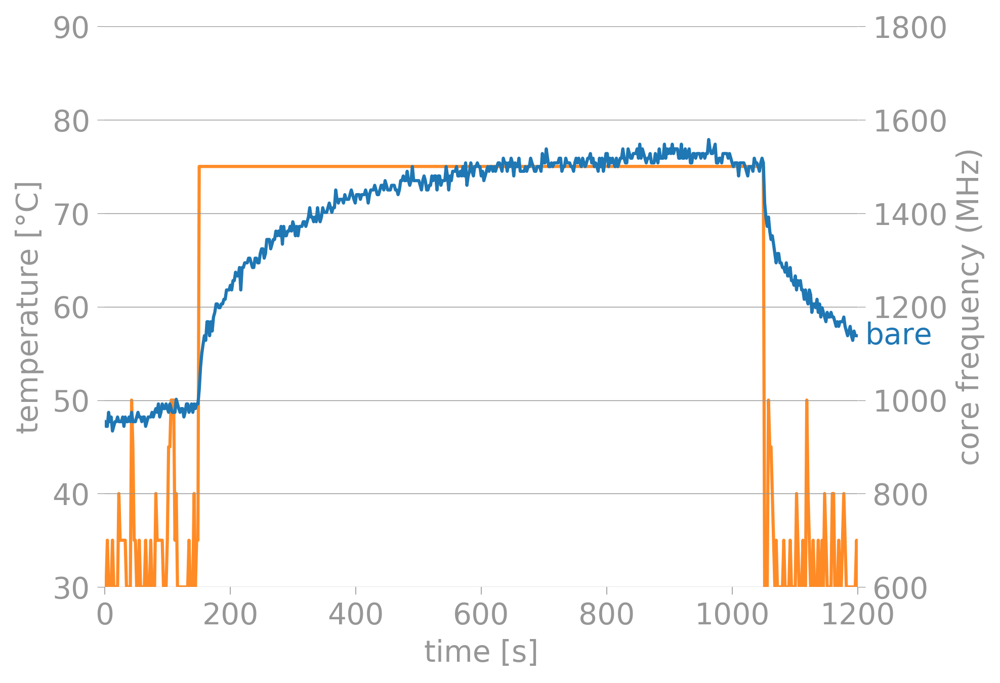
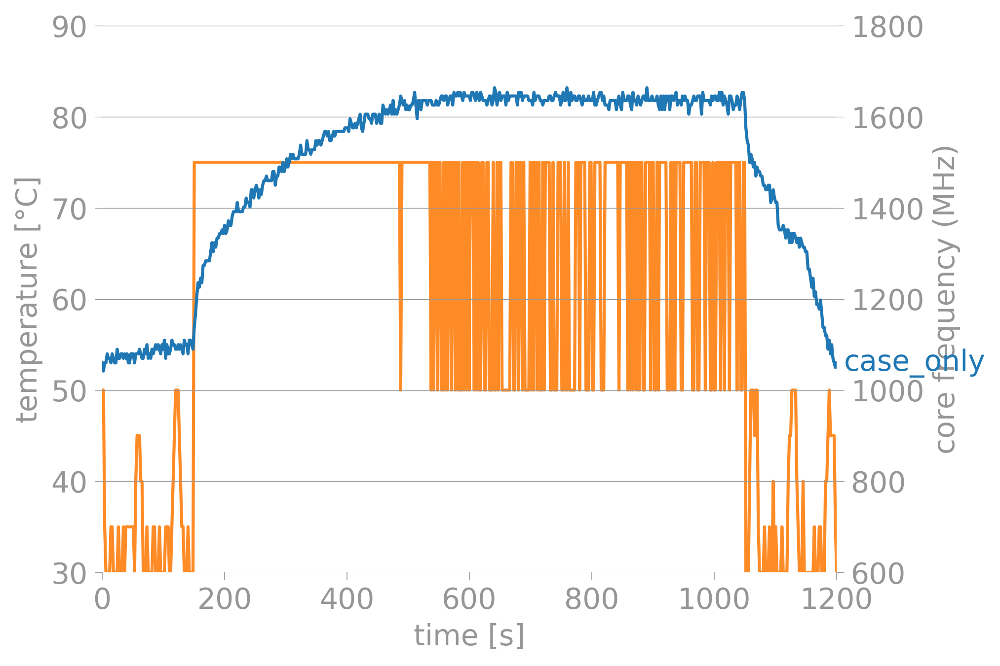
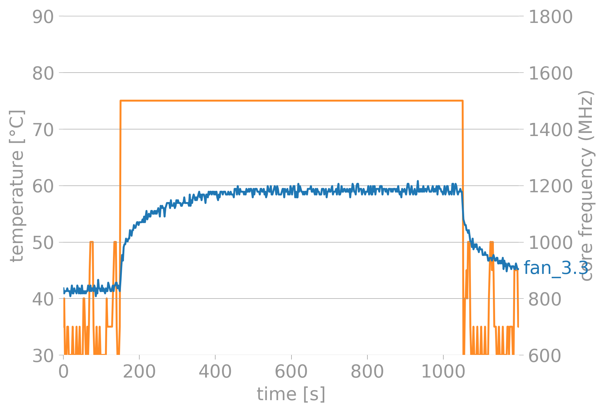

Title: Raspberry-Pi-Cooling
Date: 2021-06-20
Tags: CS, Tech
Summary: Started using the Raspberry-Pi4 seriously and ran sone benchmarks testing out a Fan-Case that is locally available in India.

Got a raspberry Pi 4(8gb). I ran a bitorrent on-it and used it mainly as a seedbox. Primary target was seeding Libgen torrents. This was fine for a while and there was no significant heating.

Now, I want to turn this into a local home-storage/home-media server. This will be some work for the small computer and needed some active-cooling.

Took some time to decide which case to buy, as the blogs/tests online were mostly testing cases available in the international market. This is one of the cheapest Raspberry-Pi cases available in India and I wanted to test how this one performs.

# Table 0f Contents
- [Table 0f Contents](#table-0f-contents)
- [The Setup](#the-setup)
- [The Benchmark](#the-benchmark)
- [Results](#results)
    - [Bare-Board](#bare-board)
    - [Case - No Fan](#case---no-fan)
    - [Fan - 3.3V](#fan---33v)
    - [Fan 5V](#fan-5v)
- [Decision and Observations](#decision-and-observations)
- [Improvement](#improvement)
    - [Data-Files](#data-files)

# The Setup
The computer the Raspberry-Pi4 8GB version.
The tool that I am using to stress-test the board is [stressberry](https://github.com/nschloe/stressberry)

The case I bought is [this](https://www.amazon.in/gp/product/B082ZQSHFZ/ref=ppx_yo_dt_b_asin_title_o01_s01?ie=UTF8&psc=1).

The screws that hold the fan onto the top of the case can come loose. a small annoyance, that needs to be taken care of.

Here are some photos of said product.
>
> The closed case
>
> The top cover removed. The cover has some gap to aid in airflow.

It is a plastic case with a fan. The recommended way is to install the fan in a push configuration. This means that the fan will be blowing air onto the CPU heat sink. I am using the stock-heat sink that came with the pi.

The fan has 2 modes of operation; 3.3V and 5V.

# The Benchmark
For the tests, I ran 5 tests in all.
  1. bare-board (15min)
  2. Case - No fan (15min)
  3. Fan - 3.3V (15min)
  4. Fan - 5V (15min)
  5. Fan - 3.3V (extended)

The `bare-board` case is meant to be the base-case.
The second case is meant to illustrate a fan failure. I had the fan installed but didnt power it.
The third and fourth cases were used just to test how well the fan performs at different configurations.
The fifth case was used to check if the 3.3V config was sustainable for longer periods of time or not.

All the raw output files generated by stressberry is available on the repo.

# Results

Here are some charts!
They were created with `stressberry-plot`.
The blue line represents the temp and the orange line is the CPU-Freq.

The Pi throttles itself at 85-C. We only see this behaviour in one of the test cases.

## Bare-Board

>

The Pi idles at `50-C` and the temperature starts climbing as soon as we start stressing it.
It settles at `75-C`

## Case - No Fan

>

The Pi idles at `55-C` and the temperature starts climbing as soon as we start stressing it.
It settles at `85-C` We can see throttling in the chart.

## Fan - 3.3V

>

The Pi idles at `43-C` and the temperature starts climbing as soon as we start stressing it.
It settles at `60-C`.

## Fan 5V

>

The Pi idles at `38-C` and the temperature starts climbing as soon as we start stressing it.
It settles at `52-C`. This was the coolest config, but the fan started making a very shrill noise which was very annoying.

# Decision and Observations
I have decided to let the Pi run with the 3.3V Fan config.
Its not too cool, its not too loud.

One thing I need to keep in mind is that the day these tests were performed was a rather cool day. So I have not taken the environmental factors into account. Maybe in the summer months, `5V` will be neccesary. We will cross that bridge when we get to it.

To test my decision, I ran antoher test, this time for 30 mins to see if anythig changes. I was happy with the results.

>

# Improvement
I am planning to use the GPIO headers on the PI to automate the on-off situation of the Pi. This way, it can tell the fan when to run and what-not.

I could also take better photographs!!!

## Data-Files
You can download the files:

- [bare](assets/2021-06-20-Raspberry-Pi-Cooling/bare.out)
- [case_only](assets/2021-06-20-Raspberry-Pi-Cooling/case_only.out)
- [fan_3.3](assets/2021-06-20-Raspberry-Pi-Cooling/fan_3.3.out)
- [fan_5](assets/2021-06-20-Raspberry-Pi-Cooling/fan_5.out)
- [fan_3.3_extend](assets/2021-06-20-Raspberry-Pi-Cooling/fan_3.3_extend.out)